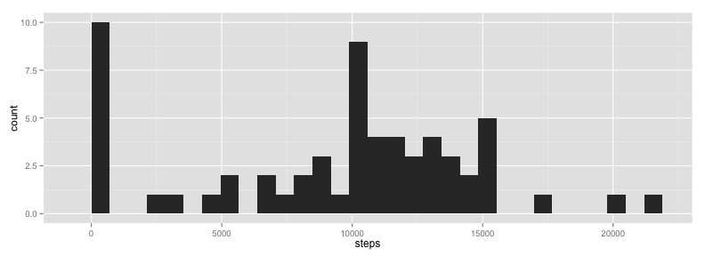
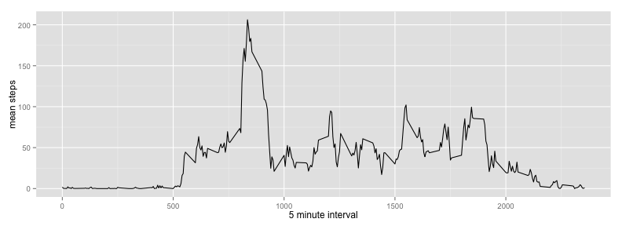
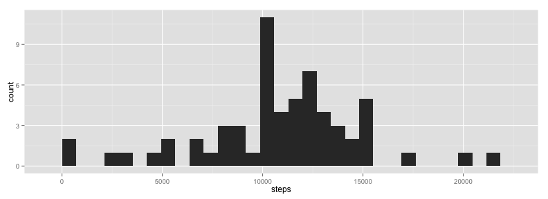
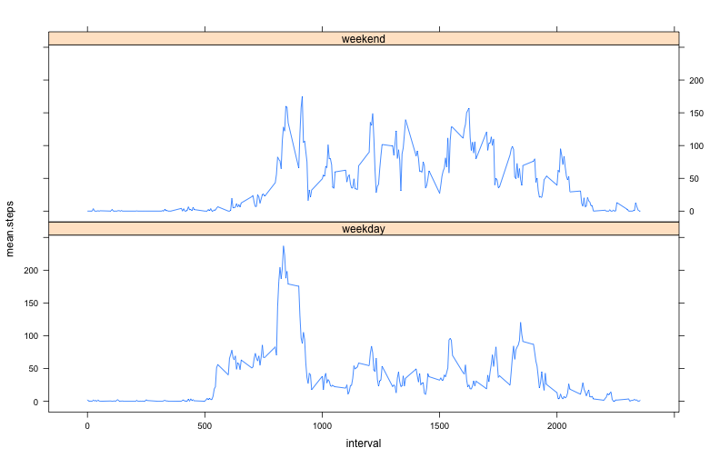

# Reproducible Research: Peer Assessment 1


```
## Loading required package: lubridate
## Loading required package: dplyr
```

## Loading and preprocessing the data
We require a couple of packages for data manipulation and plotting and then load the activity data set.

```r
df <- read.csv("activity.csv")
df$date <- ymd(df$date)
```


## What is mean total number of steps taken per day?

Ignoring unavailable data, here is a histogram of the total number of steps taken per day.

```r
df.days <- group_by(df, date)
daily.steps <- summarise(df.days, sum(steps, na.rm = TRUE))
names(daily.steps) <- c("date", "steps")
ggplot(daily.steps, aes(x = steps)) + geom_histogram()
```

 


The mean number of steps per day is 9354.2295, while the median is 10395. That's a lot of steps! (Note: the FitBit makes 10000 daily steps a default goal, and we see that this dataset supports the belief that this is not an unrealistic goal for this individual. It would be interesting to know how long this person has been using this device.)

## What is the average daily activity pattern?

In order to investigate the daily step pattern, we first group the data by five-minute interval identifier, and then we take the mean the of steps over all days.

```r
df.intervals <- group_by(df, interval)
interval.means <- summarise(df.intervals, mean(steps, na.rm = TRUE))
names(interval.means) <- c("interval", "mean.steps")
```


Here is a plot of the resulting time series of means.

```r
ggplot(interval.means, aes(x = interval, y = mean.steps)) + geom_line() + xlab("5 minute interval") + 
    ylab("mean steps")
```

 

The interval containing the maximal number of steps (on average across all days in the dataset) is the one with identifier 835, corresponding to morning walking (perhaps related to getting to work), with 206.1698 steps, on average.

## Imputing missing values

Unfortunately, this data set has a lot of holes! There are 2304 rows with a missing step count. Let's be slightly more specific: let's see if any pair of minute interval with day of the week are entirely missing data during the entire collection period.


```r
dff <- mutate(df, weekday = weekdays(date), pair = paste(weekday, interval))
df.pair <- group_by(dff, pair)
holes <- summarise(df.pair, sum(!is.na(steps)))
```


The number of such pairs missing data is 0. We will impute the missing values by taking the mean over the corresponding pair (weekday, minute interval.)


To do this, we take the mean of the steps by pair for the non-NA observations of that pair and replace NA values in the original dataset with the imputed values.

```r
imputed <- summarise(df.pair, mean(steps, na.rm = TRUE))
names(imputed) <- c("pair", "value")
dff[is.na(dff$steps), ]$steps <- as.numeric(sapply(dff[is.na(dff$steps), ]$pair, 
    function(x) imputed[imputed$pair == x, 2]))
```


With these imputed values, let us recreate the histogram of steps per day and recalculate the mean and median.


```r
dff.days <- group_by(dff, date)
daily.steps.imputed <- summarise(dff.days, sum(steps, na.rm = TRUE))
names(daily.steps.imputed) <- c("date", "steps")
ggplot(daily.steps.imputed, aes(x = steps)) + geom_histogram()
```

 


The mean is 10821.2096 and the median is 
11015.

## Are there differences in activity patterns between weekdays and weekends?

Let's analyze the difference between weekday and weekend activity.


```r
week.split <- function(d) {
    if (d %in% c("Saturday", "Sunday")) {
        "weekend"
    } else {
        "weekday"
    }
}
dff$day.type <- sapply(dff$weekday, week.split)
dff$day.type <- as.factor(dff$day.type)
```

Now we can make the time series plots.

```r
dff.weekdays.intervals <- group_by(dff[dff$day.type == "weekday", ], interval)
weekday.interval.means <- summarise(dff.weekdays.intervals, mean(steps))
names(weekday.interval.means) <- c("interval", "mean.steps")
weekday.interval.means$day.type <- "weekday"

dff.weekends.intervals <- group_by(dff[dff$day.type == "weekend", ], interval)
weekend.interval.means <- summarise(dff.weekends.intervals, mean(steps))
names(weekend.interval.means) <- c("interval", "mean.steps")
weekend.interval.means$day.type <- "weekend"

final.df <- rbind(weekday.interval.means, weekend.interval.means)
xyplot(mean.steps ~ interval | day.type, final.df, type = "l", layout = c(1, 
    2))
```

 

We can observe that the "going to work" bump does not happen on weekends, but the activity level seems to be generally higher. More fun on the weekend!
